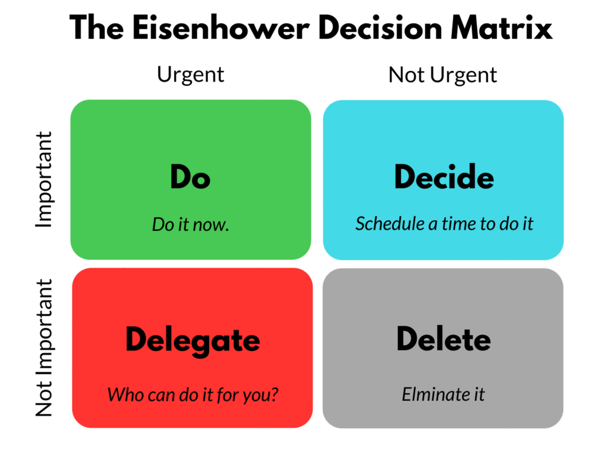
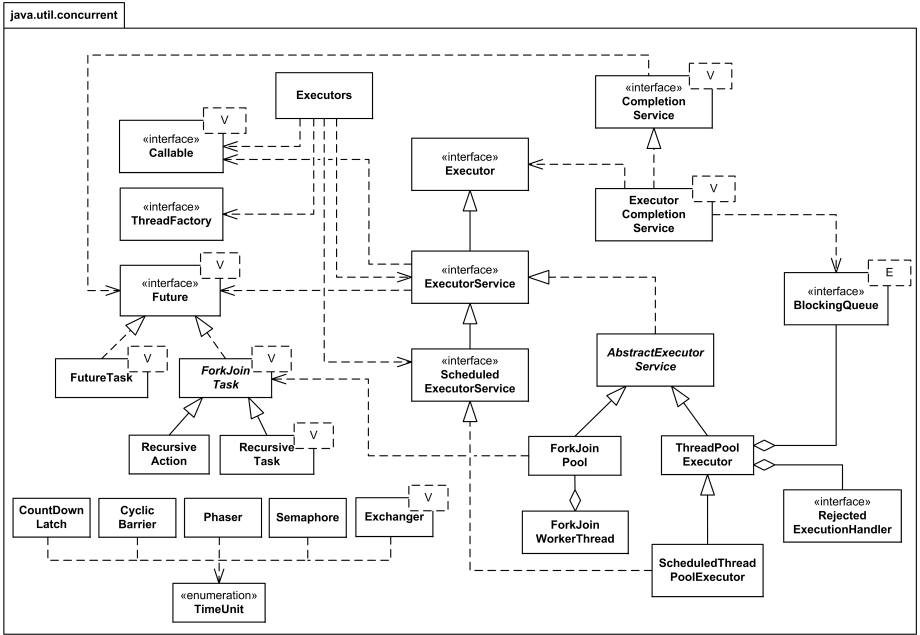

name: inverse
layout: true
class: center, middle, inverse
---
# Software Architecture
## Introduction

.footnote[<a href="mailto:christian.ribeaud@fhnw.ch">Christian Ribeaud</a>]
---
template: inverse
# What is Software Architecture?
---
layout: false
.left-column[
  ## SOA
  ### Quotes
]
.right-column[
_Architecture represents the significant design decisions that shape a system, where significant is measured by cost of change._ — **Grady Booch**

_If you think good architecture is expensive, try bad architecture._ — **Brian Foot and Joseph Yoder**
]
---
.left-column[
  ## SOA
  ### Quotes
  ### Definition
]
.right-column[
**Application architecture** is the process of converting software characteristics such as _flexibility_, _scalability_, _feasibility_, _reusability_, and _security_ into a structured solution that meets the technical and the business expectations.

While **software architecture** is responsible for the skeleton and the high-level infrastructure of a software, the **software design** is responsible for the code level design such as, what each module is doing, the classes scope, and the functions purposes, etc.

### Design Principles
- The Single Responsibility Principle (SRP)
- The Open-Closed Principle (OCP)
- ...
]
???
- Some people does not make any difference between **architecture** and **design**, arguing that low-level details and high-level structure are all part of the same whole. You can't have one without the other (p. 4).
- https://codeburst.io/software-architecture-the-difference-between-architecture-and-design-7936abdd5830
---
.left-column[
  ## SOA
  ### Quotes
  ### Definition
  ### Patterns
]
.right-column[
### Serverless Architecture
Serverless architecture (also known as serverless computing or function as a service, **FaaS**) is a software design pattern where applications are hosted by a third-party service, eliminating the need for server software and hardware management by the developer.
### Event-Driven Architecture
This architecture depends on event producers and event consumers. The main idea is to decouple your system's parts and each part will be triggered when an interesting event from another part has got triggered.
### Microservices Architecture
Microservices - also known as the microservice architecture - is an architectural style that structures an application as a collection of services that are. Highly maintainable and testable. Loosely coupled. Independently deployable. Organized around business capabilities.
]
???
- Don't mix up design patterns like Factory or Adaptor patterns and the architecture patterns.
---
.left-column[
  ## SOA
  ### Quotes
  ### Definition
  ### Patterns
  ### Lehman's Laws
]
.right-column[
### Lehman's Laws
#### x-type Systems
https://www.youtube.com/watch?v=08ZUNsekFdY
#### Law of Continuing Change
_An **E-type** system must be continually adapted or it becomes progressively less satisfactory._
]
???
- https://en.wikipedia.org/wiki/Lehman%27s_laws_of_software_evolution
- 8 laws
---
template: inverse
# A Tale of Two Values
---
.left-column[
  ## Two Values
  ### Behavior
]
.right-column[
The _first_ value of software is its **behavior**.

Many programmers believe that is the entirety of their job. They believe their job is to make the machine implement the requirements and to fix any bugs. They are sadly mistaken.

**behavior** is _urgent_ but not always particulary _important_.
]
---
.left-column[
  ## Two Values
  ### Behavior
  ### Structure
]
.right-column[
The second value of software has to do with the word **software** — a compound word composed of _soft_ and _ware_.

**architecture** is _important_ but never particularly _urgent_.

]
---
template: inverse
# Component Architecture
---
.left-column[
  ## Component Architecture
]
.right-column[
An individual **software component** is a software package (_.jar_, _.dll_), a web service, a web resource, or a module that encapsulates a set of related functions (or data).

]
???
- Based on use case analysis
- So-called _Implementation/Development View_ (4+1 view model)
- An example of two components expressed in **UML 2.0**. The checkout component, responsible for facilitating the customer's order, requires the card processing component to charge the customer's credit/debit card (functionality that the latter provides).
- https://c4model.com/
---
template: inverse
# Class/Package Diagrams
---
**Class Diagrams** dive deeper into the software application architecture. These will further detail the software application architecture for a particular component of the system.

**Package Diagrams** are used to simplify complex class diagrams, you can group classes into packages. A package is a collection of logically related UML elements.

???
- So-called _Logical/Structural View_ (4+1 view model)
- https://medium.com/@warren2lynch/uml-what-is-package-diagram-how-to-use-it-dbd317c07d5d
- Package by layer (p. 304), by feature (p. 306), by component (p. 310)
---
.left-column[
  ## UML
  ### Why?
]
.right-column[
As **Software Architect** you need a graphical model to represent/communicate what you are creating or studying. Why **UML**?
- Standard for _visual modeling_
- Tooling support
- Suitable for software design
- Flexible
]
???
- _Box-and-Arrow_ diagrams
---
.left-column[
  ## UML
  ### Why?
  ### Example
]
.right-column[

]
???
- https://courses.cs.washington.edu/courses/cse403/09sp/lectures/lecture07-uml.pdf
---
## Links
- https://martinfowler.com/architecture/
- [UML Cheatsheet](uml_cheatsheet.de.pdf)
- https://dev.to/simonbrown/
---
## Abilities
- You can provide an established definition for the term software architecture and individual aspects
from it with tasks to be solved during software development.
- You can understand and explain the basic statements of an **UML** diagrams.
- You can describe different types of architecture components from different views of a software system.
- In object-oriented programming, you can choose between the **Logical View** and the **Development View**
distinguish between them.
---
.left-column[
  ## Exercises
  ### Association vs Aggregation vs Composition
]
.right-column[
Explain the difference between **Association**, **Aggregation** and **Composition** using simple **UML** diagrams.
]
???
https://www.visual-paradigm.com/guide/uml-unified-modeling-language/uml-aggregation-vs-composition/
---
.left-column[
  ## Exercises
  ### Association vs Aggregation vs Composition
  ### Class Diagram
]
.right-column[
  Analyse following class diagram. Do you understand all the connections?

  
]
---
.left-column[
  ## Exercises
  ### Association vs Aggregation vs Composition
  ### Class Diagram
  ### Broken Window
]
.right-column[
_A friend once told me about an experiment where someone left a new car in the street — it remained there untouched for a week._

_They repeated the experiment again, but this time they made a deliberate crack in the windscreen of the car, and within a few days, the car was completely burnt out._

How could this story be extrapolated to **Software Architecture**?
]
???
- https://blog.codinghorror.com/the-broken-window-theory/
- https://medium.com/@matryer/broken-windows-theory-why-code-quality-and-simplistic-design-are-non-negotiable-e37f8ce23dab
