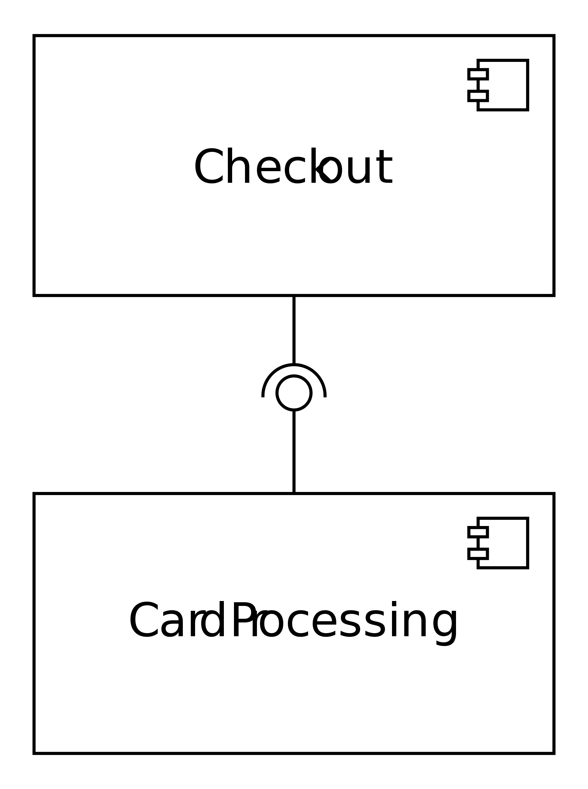
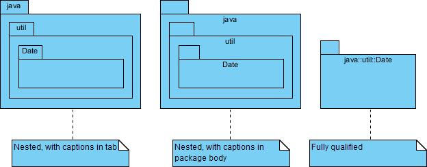
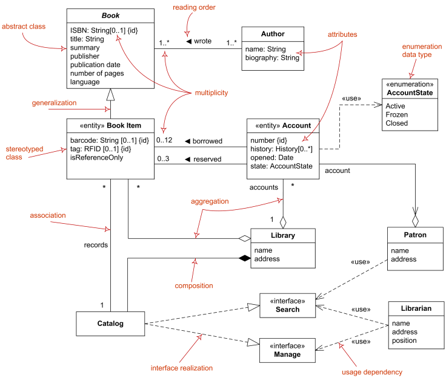

name: inverse
layout: true
class: center, middle, inverse
---
# Software Architecture

.footnote[<a href="mailto:christian.ribeaud@fhnw.ch">Christian Ribeaud</a>]
---
template: inverse
# What is Software Architecture?
---
layout: false
.left-column[
  ## SOA
  ### Quotes
]
.right-column[
_Architecture represents the significant design decisions that shape a system, where significant is measured by cost of change._ -- **Grady Booch**

_If you think good architecture is expensive, try bad architecture._ -- **Brian Foot and Joseph Yoder**
]
---
.left-column[
  ## SOA
  ### Quotes
  ### Definition
]
.right-column[
**Application architecture** is the process of converting software characteristics such as _flexibility_, _scalability_, _feasibility_, _reusability_, and _security_ into a structured solution that meets the technical and the business expectations.

While **software architecture** is responsible for the skeleton and the high-level infrastructure of a software, the **software design** is responsible for the code level design such as, what each module is doing, the classes scope, and the functions purposes, etc.

### Design Principles
- The Single Responsibility Principle (SRP)
- The Open-Closed Principle (OCP)
- ...
]
???
- Some people does not make any difference between **architecture** and **design**, arguing that low-level details and high-level structure are all part of the same whole. You can't have one without the other (p. 4).
- https://codeburst.io/software-architecture-the-difference-between-architecture-and-design-7936abdd5830
---
template: inverse
# A Tale of Two Values
---
template: inverse
# Component Architecture
---
layout: false
.left-column[
  ## Component Architecture
]
.right-column[
An individual **software component** is a software package (_.jar_, _.dll_), a web service, a web resource, or a module that encapsulates a set of related functions (or data).

]
???
- Based on use case analysis
- So-called _Implementation/Development View_ (4+1 view model)
- An example of two components expressed in **UML 2.0**. The checkout component, responsible for facilitating the customer's order, requires the card processing component to charge the customer's credit/debit card (functionality that the latter provides).
---
template: inverse
# Class/Package Diagrams
---
**Class Diagrams** dive deeper into the software application architecture. These will further detail the software application architecture for a particular component of the system.

**Package Diagrams** are used to simplify complex class diagrams, you can group classes into packages. A package is a collection of logically related UML elements.

???
- So-called _Logical/Structural View_ (4+1 view model)
- https://medium.com/@warren2lynch/uml-what-is-package-diagram-how-to-use-it-dbd317c07d5d
---
.left-column[
  ## UML
  ### Why?
]
.right-column[
As **Software Architect** you need a graphical model to represent/communicate what you are creating or studying. Why **UML**?
- Standard for _visual modeling_
- Tooling support
- Suitable for software design
- Flexible
]
???
- _Box-and-Arrow_ diagrams
---
.left-column[
  ## UML
  ### Why?
  ### Example
]
.right-column[

]
???
- https://courses.cs.washington.edu/courses/cse403/09sp/lectures/lecture07-uml.pdf
---
## Links
- https://martinfowler.com/architecture/
- https://blog.codinghorror.com/the-broken-window-theory/
- [UML Cheatsheet](uml_cheatsheet.de.pdf)
---

---
.left-column[
  ## Abilities
]
.right-column[

]
---
.left-column[
  ## Knowledge
]
.right-column[
]
---
.left-column[
  ## Exercises
]
.right-column[
https://silvae86.github.io/teaching/solutions/uml/class/
]
