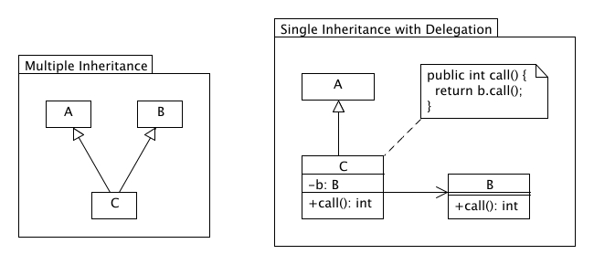
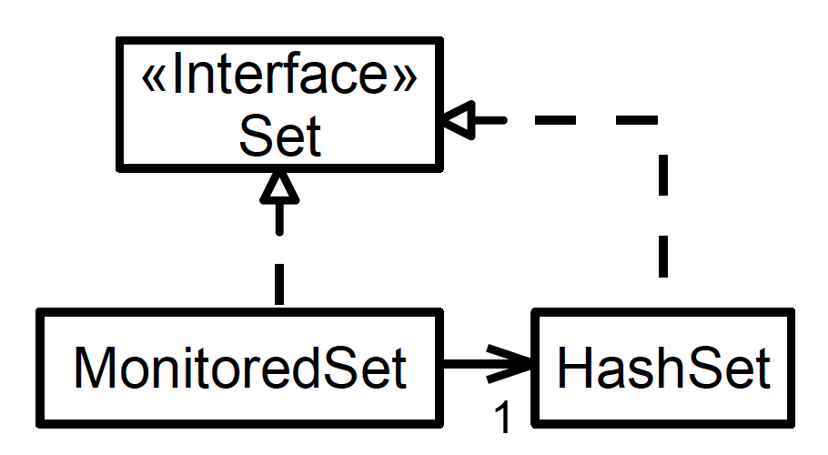

name: inverse
layout: true
class: center, middle, inverse
---
# Software Architecture
## Object-Oriented Programming

.footnote[<a href="mailto:christian.ribeaud@fhnw.ch">Christian Ribeaud</a>]
---
template: inverse
# Encapsulation
---
layout: false
.left-column[
  ## Encapsulation
  ### Information Hiding
]
.right-column[
**Encapsulation** refers to the bundling of data with the methods that operate on that data, or the restricting of direct access to some of an object's components.

### Information Hiding
- Separates the **How** (implementation) from the **What** (interface).
- Prevents unwanted couplings between parts of the system.
- Prevents users from setting the internal data of the component into an invalid or inconsistent state.
- It reduces complexity.
- Allows independent development of modules, components or classes (given the interface is stable and well documented).
- Allows testability of individual modules, components, or classes (dummies and mocks of the interfaces replace the rest of the systems).
]
---
.left-column[
  ## Encapsulation
  ### Information Hiding
  ### Examples
]
.right-column[
```java
public class NoInformationHidingNorEncapsulation {
  public ArrayList points = new ArrayList();
}
```
```java
public class NoInformationHidingButEncapsulation {
  private ArrayList points = new ArrayList();
  public ArrayList getPoints() {
    return points;
  }
}
```
```java
public class InformationHidingAndEncapsulation{
  private ArrayList points = new ArrayList();
  public List getPoints(){
    return points;
  }
}
```
```java
public class InformationHidingWithoutEncapsulation {
  public List points = new ArrayList();
}
```
]
???
- What is the problem here?
- In **Java**, encapsulation is done using classes, interfaces, access modifiers (public, protected, private, and _default_), setters and getters.
---
template: inverse
# Inheritance
---
layout: false
.left-column[
  ## Inheritance
]
.right-column[
**Inheritance** is a mechanism where a new class is derived from an existing class. In **Java**, classes can inherit the methods and properties of another class.

Unproblematic if:
- **B** extends **A**. No operation is overridden.
- **B** extends operationen which MUST be overridden (i.e., `init()` of **Applet** class).
]
???
- An _is a_ relationship
- The downside of this technique is that changing the parent class's implementation will create cascading effects through every subclass. Wait — isn’t that a benefit? We’ve now arrived at the double-edged sword that is inheritance, in that with great power comes great responsibility. In short:
  - Strong dependency between super- and subclass
  - Violation of the secret principle possible: behavior of the subclass may depend on implementation details of the superclass.
---
layout: false
.left-column[
  ## Inheritance
  ### Problematic
]
.right-column[
```java
import java.util.*;
public class MonitoredSet extends HashSet {
  private int addCounter;
  public int getAddCounter() {
    return addCounter;
  }
  public boolean add(Object object) {
    addCounter++;
    return super.add(object);
  }
  public boolean addAll(Collection collection) {
    addCounter += collection.size();
    return super.addAll(collection);
  }
}
```
This leads to an `AssertionError` in following code fragment:
```java
MonitoredSet set = new MonitoredSet();
set.addAll(Arrays.asList("a", "b", "c"));
assert set.getAddCounter() == 3;
```
]
???
- Why?
---
.left-column[
  ## Inheritance
  ### Problematic
  ### Composition
]
.right-column[
**Solution**: `MonitoredSet` delegates to `HashSet`:
```java
import java.util.*;
public class MonitoredSet implements Set{
  private Set set = new HashSet();
  private int addCounter;
  public int getAddCounter() {
    return addCounter;
  }
  public boolean add(Object object) {
    addCounter++;
    return set.add(object);
  }
  public boolean addAll(Collection collection) {
    addCounter += collection.size();
    return set.addAll(collection);
  }
  ...
}
```

]
???
- A _has a_ relationship
- **Association** vs. **Aggregation**
- Should we really prefer **Composition** over **Inheritance**? **Composition** introduces fewer dependencies than inheritance, and makes less assumptions about about how the program will be used in the future. That being said **Inheritance** offers powerful features that can provide excellent benefits when used correctly. Maybe it would more instructive to rephrase _prefer composition_ to _are you sure you need inheritance?_. Choose wisely!
---
template: inverse
# Polymorphism
---
.left-column[
  ## Polymorphism
]
.right-column[
**Polymorphism** refers to a programming language's ability to process objects differently depending on their data type or class (_single action in different ways_).

As example, in **Java** you have a superclass with method `print()` which is inherited by subclasses. But in subclasses, the method `print()` you want something different from method `print()` in superclass.

You want the _ability to redefine_ methods for subclasses, this is what we call **Polymorphism**.
]
???
- There are two types of polymorphism in **Java**: _compile-time_ polymorphism (where we can perform method overloading) and _runtime_ polymorphism (where we perform method overriding).
- https://www.dariawan.com/tutorials/java/polymorphism-in-java/
- Power of polymorphism (p. 43)
---
## Abilities
- You understand the concepts of OO programming
---
.left-column[
  ## Exercises
  ### Properties
]
.right-column[
  Have a look at `java.util.Properties` and write your analysis.
]