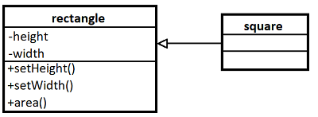
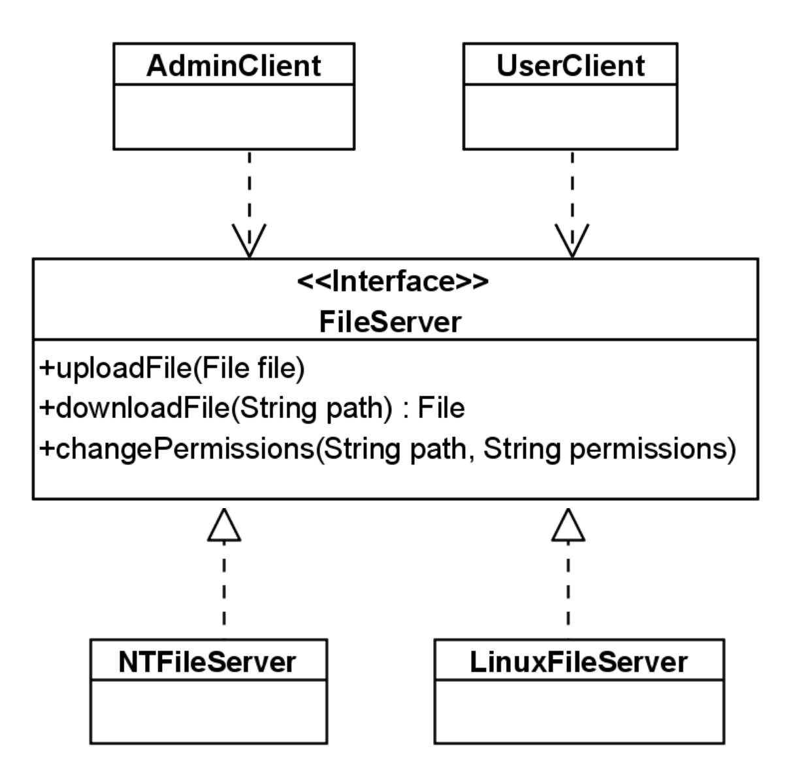
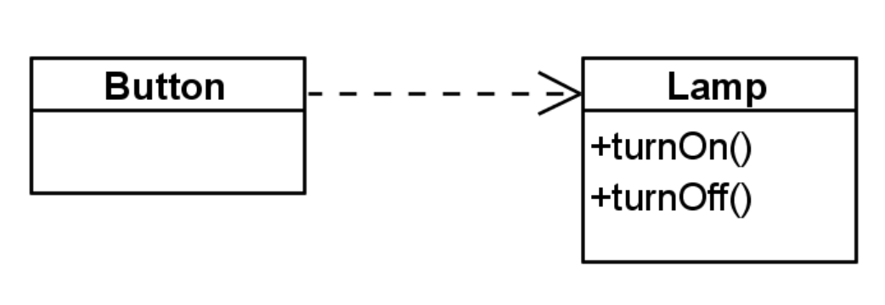

name: inverse
layout: true
class: center, middle, inverse
---
# Software Architecture
## Design Principles

.footnote[<a href="mailto:christian.ribeaud@fhnw.ch">Christian Ribeaud</a>]
---
template: inverse
# SOLID Principles
---
layout: false
# Why Principles?
- Gives advice on how to approach the design.
- Helps to avoid typical mistakes.
- Principles generates guidelines for action.
- Guidelines for quality assessment. Metrics are derived from principles to make quality measurable.
- Principles are knowledge based on experience:
  - Abstracted from many years of experience.
  - Adopted, confirmed and promulgated by others.
???
Good software systems begin with clean code. On the one hand, if the bricks aren't well made, the architecture of the building doesn't matter much. On the other hand, you can make a substantial mess with well-made bricks. This is where the SOLID principles come in.
---
layout: false
.left-column[
  ## SOLID
  ### S
]
.right-column[
## Single Responsability Principle
An active corollary to [Conway](https://en.wikipedia.org/wiki/Conway%27s_law)'s law: The best structure fo a software system is heavily influenced by the social structure of the organization that uses it so that each software module has one, and only one, reason to change.
]
---
.left-column[
  ## SOLID
  ### S
]
.right-column[
## Minimize Coupling

- No coupling between classes that do not perform a common task.
- Coupling between modules or components only via interfaces


]
---
.left-column[
  ## SOLID
  ### S
]
.right-column[
## Maximize Cohesion

- Tight coupling between classes that perform a common task.
- Classes which perform a common task belong together to the same package.
- Classes which are only weakly coupled belong to different packages (**Separation of Concerns** on _package_ level).

<video width="550" controls>
 <source src="cohesion_and_coupling.mp4" type="video/mp4">
Your browser does not support the video tag.
</video>
]
---
.left-column[
  ## SOLID
  ### S
  ### O
]
.right-column[
## OCP: The Open-Closed Principle
Software entities (classes, modules, functions, components, etc.) should be closed for modification, but open for extension.

### Closed For modification
New features getting added to the software component, should NOT have to modify existing code.

### Open For extension
A software component should extendable to add a new feature or to add a new behavior to it.
]
---
.left-column[
  ## SOLID
  ### S
  ### O
]
.right-column[
### Possible implementations of this principle
- Create subclass and overwrite method.
- Reuse existing classes by delegation.

### Frameworks are examples for the application of this principle:
- To use frameworks, base (_abstract_) classes must be extended, _interfaces_ must be implemented.
- Frameworks are usually 3th-party software and as such not changeable (except with Open Source)
]
---
.left-column[
  ## SOLID
  ### S
  ### O
]
.right-column[
### Rigid, Fragile, Immobile Designs
#### Rigid
**Rigid** designs are hard to change – every change causes many changes to other parts of the system.
#### Fragile
**Fragile** designs tend to break in many places when a single change is made.
#### Immobile
**Immobile** designs contain parts that could be useful in other systems, but the effort and risk involved with separating those parts from the original system are too big.
]
---
.left-column[
  ## SOLID
  ### S
  ### O
  ### L
]
.right-column[
## LSP: The Liskov Substitution Principle
In 1988, [Barbara Liskov](https://en.wikipedia.org/wiki/Barbara_Liskov) wrote the following as a way of defining subtypes:

_Objects should be replaceable with their subtypes without affecting the
correctness of the program._

### The Square/Rectangle Problem
The canonical example of violation of the **LSP** is the famed (or infamous, depending on your perspective) square/rectangle problem.


]
???
```
Rectangle r = ...
r.setW(5);
r.setH(2);
assert(r.area() == 10)
```
---
.left-column[
  ## SOLID
  ### S
  ### O
  ### L
]
.right-column[
<video width="550" controls>
 <source src="liskov.mp4" type="video/mp4">
Your browser does not support the video tag.
</video>
### Solution to first pattern
Break the hierarchy

### Solution to second pattern
"Tell, don't ask"
]
???
**LSP** Violations in **Java** platform classes:
- `Properties` inherits from `Hashtable`
- `Stack` inherits from `Vector`
---
.left-column[
  ## SOLID
  ### S
  ### O
  ### L
]
.right-column[
### Design-by-Contract
Two main aspects of **Design-by-Contract**:
- Contracts. Classes (resp. interfaces) explicitly specify properties:
  - that must be respected by subclasses (or implementations)
  - on which clients (aka callers) can rely.
- Contract enforcement. Tools to check (_statically_ or _dynamically_) the implementation of subclasses against contracts of superclasses.

#### Specifying Explicit Contracts
- Pre- and Post-conditions
  - Declared for every method of the class.
  - **Preconditions** MUST be true for the method to execute.
  - **Post-conditions** MUST be true after the execution of the method.
]
???
- **Comments as contracts**. Easy and always possible, but not machine checkable.
- Assertions
---
.left-column[
  ## SOLID
  ### S
  ### O
  ### L
]
.right-column[
### A Possible Contract for `Rectangle.setWidth`
```java
public class Rectangle implements Shape {
  private int width;
  private int height;
  public void setWidth(int w) {
    this.width = w;
  }
}
```
- Precondition for _setWidth_: `w > 0`
- Post-condition for _setWidth_: `getWidth() = w`, `getHeight()` was not changed
]
???
Subclasses must conform to the contract of their base class (behavioral subtyping)!
---
.left-column[
  ## SOLID
  ### S
  ### O
  ### L
]
.right-column[
### Behavioral Subtyping
#### Rule for preconditions
- Preconditions may be replaced by equal or weaker ones.
- Preconditions of a class imply preconditions of subclasses.

#### Rule for post-conditions
- Post-conditions may be replaced equal or stronger ones.
- Post-conditions of a class are implied by those of its subclasses.
]
---
.left-column[
  ## SOLID
  ### S
  ### O
  ### L
  ### I
]
.right-column[
## ISP: The Interface Segregation Principle
No client should be forced to depend on methods it does NOT use.

Two clients are implemented for the file server:
- `AdminClient`, which uses all methods.
- `UserClient`, which uses only the upload/download methods.



Do you see any problems?
]
???
- **ISP** should NOT be overdone (_interface proliferation_)
- [Duck Typing](https://en.wikipedia.org/wiki/Duck_typing)
- https://medium.com/@jcqvisser/solid-and-the-interface-segregation-principle-in-ruby-49d3b09004ae
---
.left-column[
  ## SOLID
  ### S
  ### O
  ### L
  ### I
  ### D
]
.right-column[
## DIP: The Dependency Inversion Principle
This principle tells us that the most flexible systems are those in which source code dependencies refer only to abstractions, not to concretions.

<video width="550" controls>
 <source src="dip.mp4" type="video/mp4">
Your browser does not support the video tag.
</video>
]
---
.left-column[
  ## SOLID
  ### S
  ### O
  ### L
  ### I
  ### D
]
.right-column[
### High-level, low-level Modules
Good software designs are structured into modules.
- High-level modules contain the important policy decisions and business models of an application – The identity of the application.

        High-level policy:
        The abstraction that underlies the application;
        the truth that does not vary when details are changed;
        the system inside the system;
        the metaphor.
- Low-level modules contain detailed implementations of individual mechanisms needed to realize the policy.
]
???
- High-level policies and business processes is what we want to reuse.
- If high-level modules depend on the low-level modules changes to the lower level details will force high-level modules to change.
- It becomes harder to use them in other contexts.
- It is the high-level modules that should influence the low-level details
---
.left-column[
  ## SOLID
  ### S
  ### O
  ### L
  ### I
  ### D
]
.right-column[
### Factories (p. 89-90)
]
???
- [Dependency Injection](https://en.wikipedia.org/wiki/Dependency_injection)
---
.left-column[
  ## SOLID
  ### S
  ### O
  ### L
  ### I
  ### D
]
.right-column[
### Inversion of Control
]
---
## Abilities
---
.left-column[
  ## Exercises
  ### SRP
]
.right-column[

Consider the following design, depicted in UML.

- `GUI` package uses `Rectangle` to draw rectangle shapes in the screen.
- `Rectangle` uses `DrawingUtility` to implement draw.
- `GeometricApplication` is a package for geometrical computations which also uses `Rectangle (area())`.

What do you think about the design?
]
???
- `Rectangle` has multiple responsibilities!
  1. Geometrics of rectangles represented by the method `area()`
  1. Drawing of rectangles represented by the method `draw()`
- Rectangle has low cohesion!
  - Geometrics and drawing do not naturally belong together.
- What are undesired effects of change?
- What would be a **SRP**-compliant design
---
.left-column[
  ## Exercises
  ### SRP
  ### OCP
]
.right-column[
Slide 16 of se8full.pdf
]
---
.left-column[
  ## Exercises
  ### SRP
  ### OCP
  ### DIP
]
.right-column[

Consider a design excerpt from the smart home scenario.

`Button`
- Is capable of _sensing_ whether it has been activated/deactivated by the user.
- Once a change is detected, it turns the `Lamp` on respectively off.

Do you see any problem with this design?
]
???
- We cannot reuse `Button` since it depends directly on `Lamp`. But there are plenty of other uses for Button.
- `Button` should not depend on the details represented by `Lamp`.
- These are symptoms of the real problem (Violation of DIP):
  - The high-level policy underlying this (mini) design is not independent of the low-level details.
