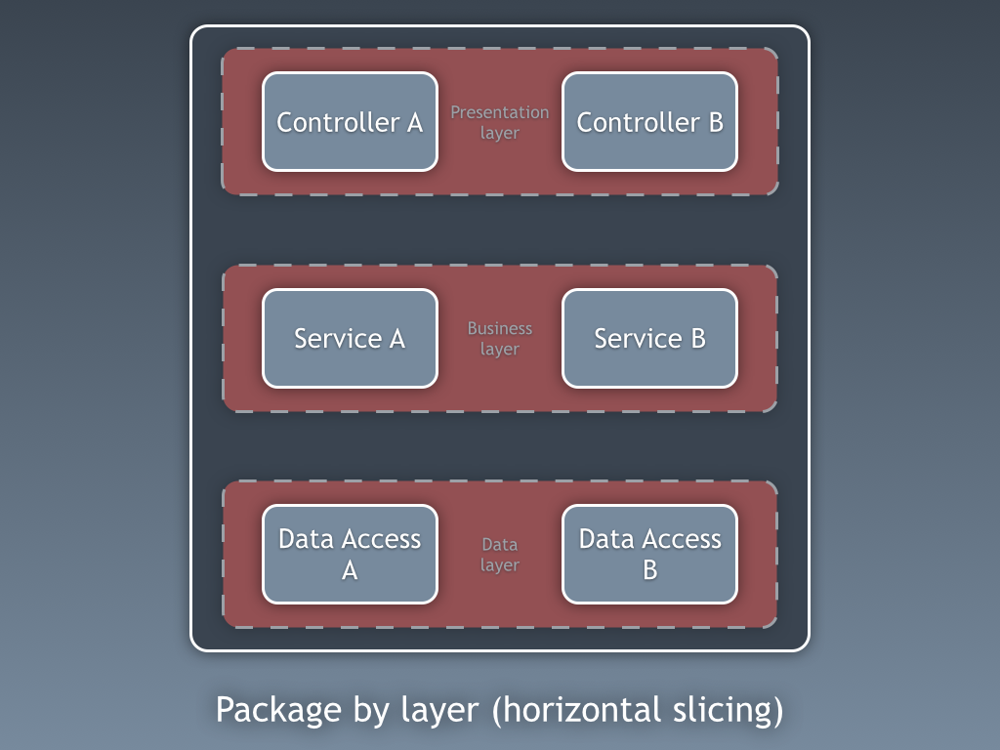
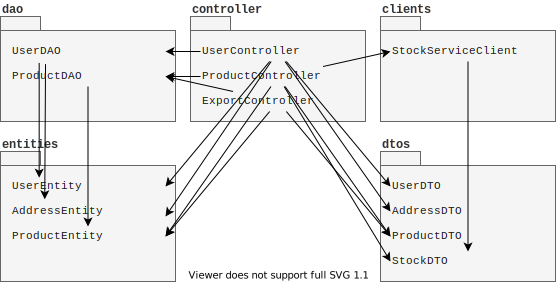
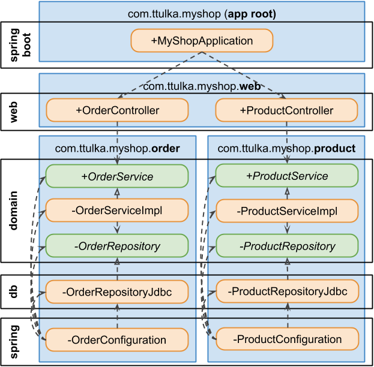

name: inverse
layout: true
class: center, middle, inverse
---
# Software Architecture
## Organizing Code

.footnote[<a href="mailto:christian.ribeaud@fhnw.ch">Christian Ribeaud</a>]
---
template: inverse
# Package by Component
???
- p. 303
- http://www.codingthearchitecture.com/2015/03/08/package_by_component_and_architecturally_aligned_testing.html
- https://phauer.com/2020/package-by-feature/
- https://blog.ttulka.com/package-by-component-with-clean-modules-in-java
---
layout: false
.left-column[
  ## Package
  ### By Layer
]
.right-column[
A very popular approach for a project structure is to _package by layer_ (or packaging by technical concerns).
This leads to a package for each technical group of classes:



* Quick way to get something up and running without a huge amount of complexity.
* The three large buckets of code isn't sufficient for big projects. Further modulization needed.
]
???
- Classical **MVC**
- Horizontal slicing/layering
---
layout: false
.left-column[
  ## Package
  ### By Layer
]
.right-column[
### Example

* Poor feature overview
* Tendency to generic, reused, and complex code.
* **DRY** vs. **KISS**.
]
???
* **Poor feature overview**. Usually, when we approach the code in a project, we have a certain domain or feature in mind that we want to change. So we are coming from a domain perspective. Unfortunately, technical packaging forces us to jump around from one package to another to grasp the big picture of a feature.
* **Tendency to generic, reused, and complex code**. Often, this approach leads to central classes containing all methods for every use case. Over time, those methods get more and more abstracted (with extra parameters and generics) to fulfill more use cases. Only one example in the above picture is the `ProductDAO` where the methods for the `ProductController` and `ExportController` are located.
---
.left-column[
  ## Package
  ### By Layer
  ### By Feature
]
.right-column[


Aka _vertical slicing_:
* Easier to navigate the codebase when you want to make a change to a feature
]
???
- You can still have a layered architecture, but the layers reside inside the feature packages.
---
.left-column[
  ## Package
  ### By Layer
  ### By Feature
]
.right-column[
### Example

* **Benefits**: Better discoverability and overview, self-contained and independent, simpler code and testability.
* **Drawbacks**: We have to write more code, we might write similar code multiple times, identification of common functionalities is tricky.
* [spring-petclinic](https://github.com/spring-projects/spring-petclinic)
]
???
- We can now see that this code base has something to do with products, users rather then the web, services, and repositories.
- Explain the `common` package:
  * technical configuration classes (**DI**, **Spring**, database connection, logging, ...)
  * It might make sense to locate all entities in the `common` package.
  * Follow [rule of three](https://en.wikipedia.org/wiki/Rule_of_three_(computer_programming))
- _Prefer duplication over the wrong abstraction._
---
layout: false
.left-column[
  ## Package
  ### By Layer
  ### By Feature
  ### By Component
]
.right-column[


This is a hybrid approach with increased modularity and an architecturally-evident coding style as the primary goals:
* A **component** in this sense is a combination of the business and data access logic related to a specific thing
* Some sort of presentation layer (web UI, desktop UI, API, standalone app, etc) built on top
]
???
If that new feature set **C** needs to access data related to **A** and **B**, it is forced to go through the public interface of components **A** and **B**. No direct access to the data access layer is allowed, and you can enforce this if you use **Java**'s access modifiers properly (you have to stop using the `public` keyword by default).
---
layout: false
.left-column[
  ## Package
  ### By Layer
  ### By Feature
  ### By Component
]
.right-column[
### Example

* https://github.com/ribeaud/blog-code-samples/tree/master/myshop
* https://blog.ttulka.com/package-by-component-with-clean-modules-in-java
]
???
1. Load the project in **IDEA**
1. Pay attention to **Modules** view of the project
1. Run project and have a look at its functionality
1. Run `mvn clean install` resp. `mvnw clean install` (using the wrapper) and have a look at the generated artefacts
---
template: inverse
# Modular Programming
---
.left-column[
  ## Modular Programming
  ### JAR
]
.right-column[
A **JAR** is a file format that enables you to bundle multiple files into a single archive (**ZIP** format) file. Typically this contains the class files and auxiliary resources associated with applets and applications.

#### Example
1. Have a look at all the **jars** generated during the previous exercise
1. From within **myshop** folder, run `./mvnw clean package spring-boot:repackage -f app/pom.xml`
1. Locate the repacked **jar** and run `java -jar app-0.jar`
]
???
* Contains compiled classes only! Where are the dependencies?
* https://www.baeldung.com/spring-boot-run-maven-vs-executable-jar
* Classpath hell:
```
java -classpath lib/guava-19.0.jar:\
                lib/hibernate-validator-5.3.1.jar:\
                lib/jboss-logging-3.3.0Final.jar:\
                lib/classmate-1.3.1.jar:\
                lib/validation-api-1.1.0.Final.jar \
     -jar MyApplication.jar
```
---
.left-column[
  ## Modular Programming
  ### JAR
  ### Module
]
.right-column[
A new language feature introduced in **Java 9** (similar to `class`, `interface`, `package`, etc.) that consists of a collection of packages, similar to how a package consists of a collection of types. It is a run-time concept.

In other words, it's a _package of Java Packages_ abstraction that allows us to make our code even more reusable.

The packages inside a module are identical to the **Java** packages we've been using since the inception of **Java**.
When we create a module, we organize the code internally in packages just like we previously did with any other project.

How did we do before **Java 9**?
]
???
- Encapsulation of types can be achieved by using a combination of packages and access modifiers (such as `private`, `protected`, or `public`). That raises an interesting question: what if you want to access that class from another package in your component, but still want to prevent others from using it? There’s no good way to do this.
- **Java** does have explicit `import` statements. Unfortunately, those imports are strictly a compile-time construct. Once you package your code into a **JAR**, there’s no telling which other **JARs** contain the types your **JAR** needs to run.
- **Maven** and/or **Gradle** for compile time dependencies management.
---
.left-column[
  ## Modular Programming
  ### JAR
  ### Module
  ### JPMS
]
.right-column[
According to [JSR 376](https://openjdk.java.net/projects/jigsaw/spec/), the key goals of modularizing the **Java SE** platform are:
- **Reliable configuration**. The module system checks whether a given combination of modules satisfies all dependencies before compiling or running code. This leads to fewer run-time errors.
- **Strong encapsulation**. Modules explicitly choose what to expose to other modules. Accidental dependencies on internal implementation details are prevented.
- **Scalable development**. Explicit boundaries enable teams to work in parallel while still creating maintainable codebases. Only explicitly exported public types are shared, creating boundaries that are automatically enforced by the module system.
- **Security**. Strong encapsulation is enforced at the deepest layers inside the JVM. This limits the attack surface of the Java runtime. Gaining reflective access to sensitive internal classes is not possible anymore.
- **Optimization**. Because the module system knows which modules belong together, including platform modules, no other code needs to be considered during **JVM** startup.
]
???
- **JPMS**: _Java Platform Module System_
- https://nipafx.dev/java-module-system-tutorial
- Modularize the **JDK** itself.
- `java --list-modules`
- `java --describe-module java.sql`
---
.left-column[
  ## Modular Programming
  ### JAR
  ### Module
  ### JPMS
  ### Definitions
]
.right-column[
* `module-info.java`. The module descriptor.
* `requires`. Allows us to declare module dependencies (compile and runtime):
```
module my.module {
        requires module.name;
}
```
* `exports`. To expose all public members of the named package:
```
module my.module {
        exports com.my.package.name;
}
```
When someone does requires `my.module`, they will have access to the public types in our `com.my.package.name` package, but not any other package.
* `uses`. Designates the _services_ our module consumes.
* `provides`. A module can also be a _service provider_ that other modules can consume.
]
???
- A service is an implementation of a specific interface or abstract class that can be consumed by other classes.
- https://www.oreilly.com/library/view/java-9-modularity/9781491954157/ch01.html
---
## Abilities
- You know and understand the differences between _package by layer_, _package by feature_ and _package by component_.
- You can explain basic differences between _classes_, _packages_ and _modules_.
- You can describe basic scenarios for using _modules_.
---
.left-column[
  ## Exercises
  ### modserv.cli
]
.right-column[
Perform following steps:
1. Clone repository [modserv.cli](https://github.com/ribeaud/ch.fhnw.swa.modserv.cli)
1. It is a plain **Java** project, no build system is used. No need to load it into **IDEA**.
1. This repository is composed of **four** modules.
1. Open any `module-info.java`
1. Run commands listed in `Commands.txt`
1. Use a build system (**Maven** or **Gradle**), saving you all the manual steps
1. Add some Unit tests
]
???
- When running the application, explain the advantage by comparison with an application with classpath
- https://melix.github.io/javaone-2017-jigsaw/
- Possible extensions:
  - Migrate a legacy application to module system
