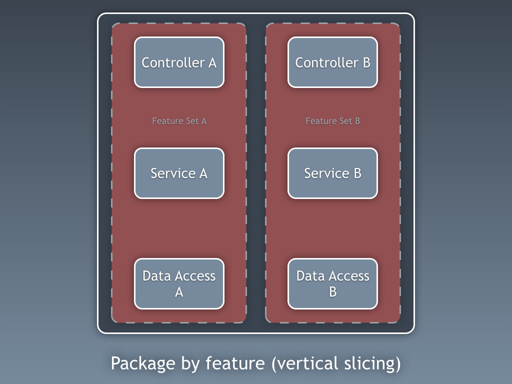
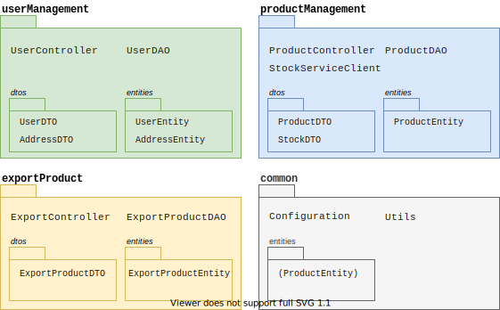

name: inverse
layout: true
class: center, middle, inverse
---
# Software Architecture
## Organizing Code

.footnote[<a href="mailto:christian.ribeaud@fhnw.ch">Christian Ribeaud</a>]
---
template: inverse
# Package by Component
???
- p. 303
- http://www.codingthearchitecture.com/2015/03/08/package_by_component_and_architecturally_aligned_testing.html
- https://phauer.com/2020/package-by-feature/
- https://blog.ttulka.com/package-by-component-with-clean-modules-in-java
---
layout: false
.left-column[
  ## Package
  ### By Layer
]
.right-column[
A very popular approach for a project structure is to _package by layer_ (or packaging by technical concerns).
This leads to a package for each technical group of classes:

* Quick way to get something up and running without a huge amount of complexity.
* The three large buckets of code isn't sufficient for big projects. Further modulization needed.
]
???
- Classical **MVC**
- Horizontal slicing/layering
---
layout: false
.left-column[
  ## Package
  ### By Layer
]
.right-column[
### Example

* Poor feature overview
* Tendency to generic, reused, and complex code.
* **DRY** vs. **KISS**.
]
???
* **Poor feature overview**. Usually, when we approach the code in a project, we have a certain domain or feature in mind that we want to change. So we are coming from a domain perspective. Unfortunately, technical packaging forces us to jump around from one package to another to grasp the big picture of a feature.
* **Tendency to generic, reused, and complex code**. Often, this approach leads to central classes containing all methods for every use case. Over time, those methods get more and more abstracted (with extra parameters and generics) to fulfill more use cases. Only one example in the above picture is the `ProductDAO` where the methods for the `ProductController` and `ExportController` are located.
---
.left-column[
  ## Package
  ### By Layer
  ### By Feature
]
.right-column[

Aka _vertical slicing_:
* Easier to navigate the codebase when you want to make a change to a feature
]
???
- You can still have a layered architecture, but the layers reside inside the feature packages.
---
.left-column[
  ## Package
  ### By Layer
  ### By Feature
]
.right-column[
### Example

* **Benefits**: Better discoverability and overview, self-contained and independent, simpler code and testability.
* **Drawbacks**: We have to write more code, we might write similar code multiple times, identification of common functionalities is tricky.
* [spring-petclinic](https://github.com/spring-projects/spring-petclinic)
]
???
- We can now see that this code base has something to do with products, users rather then the web, services, and repositories.
- Explain the `common` package:
  * technical configuration classes (**DI**, **Spring**, database connection, logging, ...)
  * It might make sense to locate all entities in the `common` package.
  * Follow [rule of three](https://en.wikipedia.org/wiki/Rule_of_three_(computer_programming))
- _Prefer duplication over the wrong abstraction._
---
layout: false
.left-column[
  ## Package
  ### By Layer
  ### By Feature
  ### By Component
]
.right-column[

This is a hybrid approach with increased modularity and an architecturally-evident coding style as the primary goals:
* A **component** in this sense is a combination of the business and data access logic related to a specific thing
* Some sort of presentation layer (web UI, desktop UI, API, standalone app, etc) built on top
]
???
If that new feature set **C** needs to access data related to **A** and **B**, it is forced to go through the public interface of components **A** and **B**. No direct access to the data access layer is allowed, and you can enforce this if you use **Java**'s access modifiers properly (you have to stop using the `public` keyword by default).
---
layout: false
.left-column[
  ## Package
  ### By Layer
  ### By Feature
  ### By Component
]
.right-column[
### Example

* https://github.com/ribeaud/blog-code-samples/tree/master/myshop
* https://blog.ttulka.com/package-by-component-with-clean-modules-in-java
]
???
1. Load the project in **IDEA**
1. Pay attention to **Modules** view of the project
1. Run project and have a look at its functionality
1. Run `mvn clean install` resp. `mvnw clean install` (using the wrapper) and have a look at the generated artefacts
---
template: inverse
# Modular Programming
---
.left-column[
  ### JAR
]
.right-column[
A **JAR** is a file format that enables you to bundle multiple files into a single archive (**ZIP** format) file. Typically this contains the class files and auxiliary resources associated with applets and applications.
]
---
.left-column[
  ### JAR
  ### Module
]
.right-column[
]
---
.left-column[
  ### JAR
  ### Module
  ### JPMS
]
.right-column[
According to [JSR 376](https://openjdk.java.net/projects/jigsaw/spec/), the key goals of modularizing the Java SE platform are:
- **Reliable configuration**. The module system checks whether a given combination of modules satisfies all dependencies before compiling or running code. This leads to fewer run-time errors.
- **Strong encapsulation**. Modules explicitly choose what to expose to other modules. Accidental dependencies on internal implementation details are prevented.
- **Scalable development**. Explicit boundaries enable teams to work in parallel while still creating maintainable codebases. Only explicitly exported public types are shared, creating boundaries that are automatically enforced by the module system.
- **Security**. Strong encapsulation is enforced at the deepest layers inside the JVM. This limits the attack surface of the Java runtime. Gaining reflective access to sensitive internal classes is not possible anymore.
- **Optimization**. Because the module system knows which modules belong together, including platform modules, no other code needs to be considered during **JVM** startup.
]
???
- https://www.oreilly.com/library/view/java-9-modularity/9781491954157/ch01.html
- https://blog.codefx.org/java/java-module-system-tutorial/
- `java --list-modules`
- `java --describe-module java.sql`
---
## Abilities

- You can explain basic differences between _classes_, _objects_ and _modules_.
- You can describe basic scenarios for using _modules_.
- You can apply and evaluate technical support for modular programming.
---
.left-column[
  ## Exercises
  ### modserv.cli
]
.right-column[
[modserv.cli](https://github.com/ribeaud/ch.fhnw.swa.modserv.cli)
]
---
.left-column[
  ## Exercises
  ### modserv.cli
  ### modserv
]
.right-column[
[modserv](https://github.com/ribeaud/ch.fhnw.swa.modserv)
]
???
- Possible extensions:
  - Add some tests to the exercises
  - Migrate a legacy application to module system
- https://blog.codefx.org/java/java-module-system-tutorial/
- https://melix.github.io/javaone-2017-jigsaw/
- https://medium.com/@tutorialspointexamples/building-java-9-modules-731ec904432a
---
.left-column[
  ## Exercises
  ### modserv.cli
  ### modserv
  ### Metrics
]
.right-column[
]
???
- Calculate cyclic dependencies (as well?)
