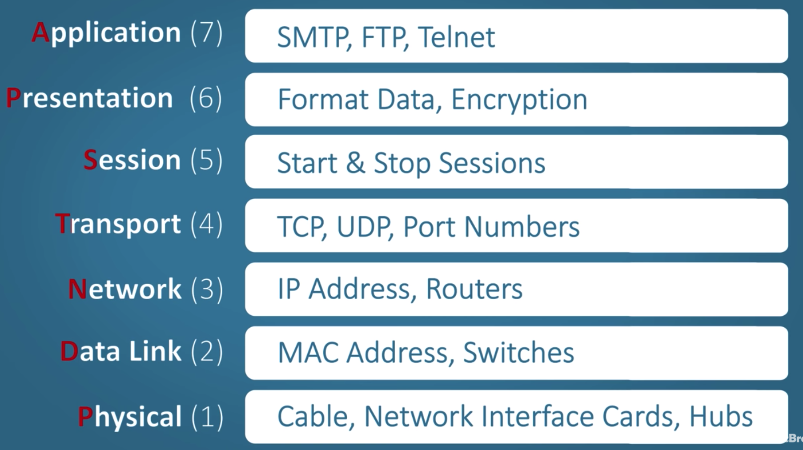
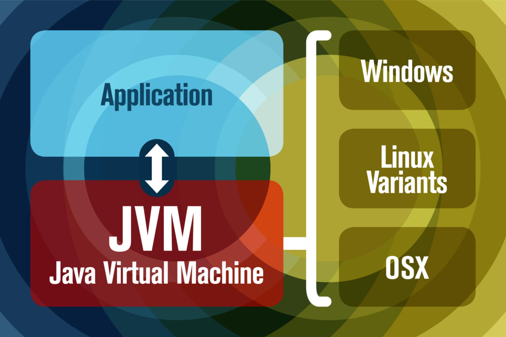
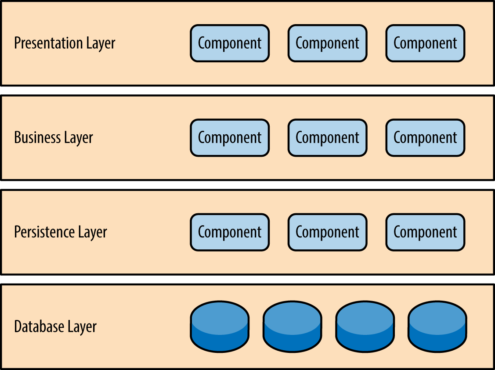
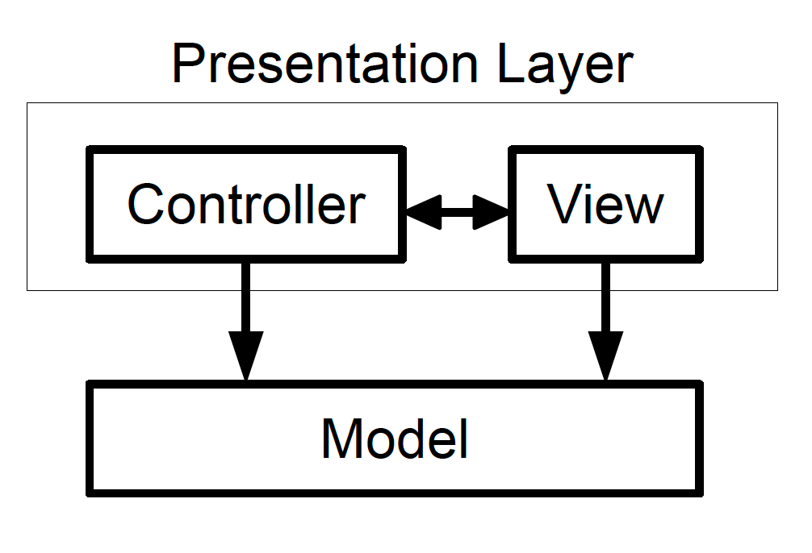
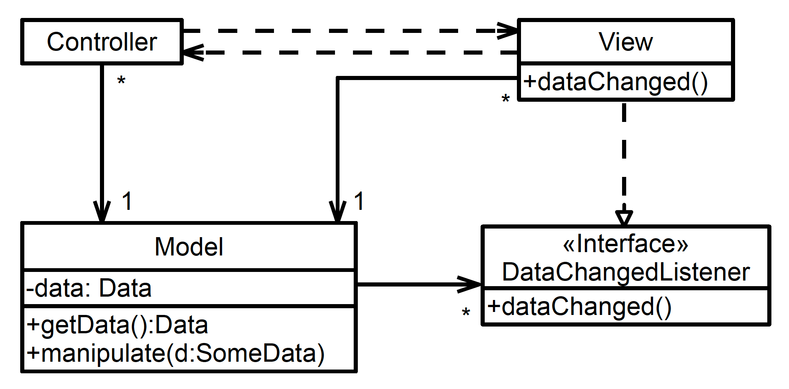
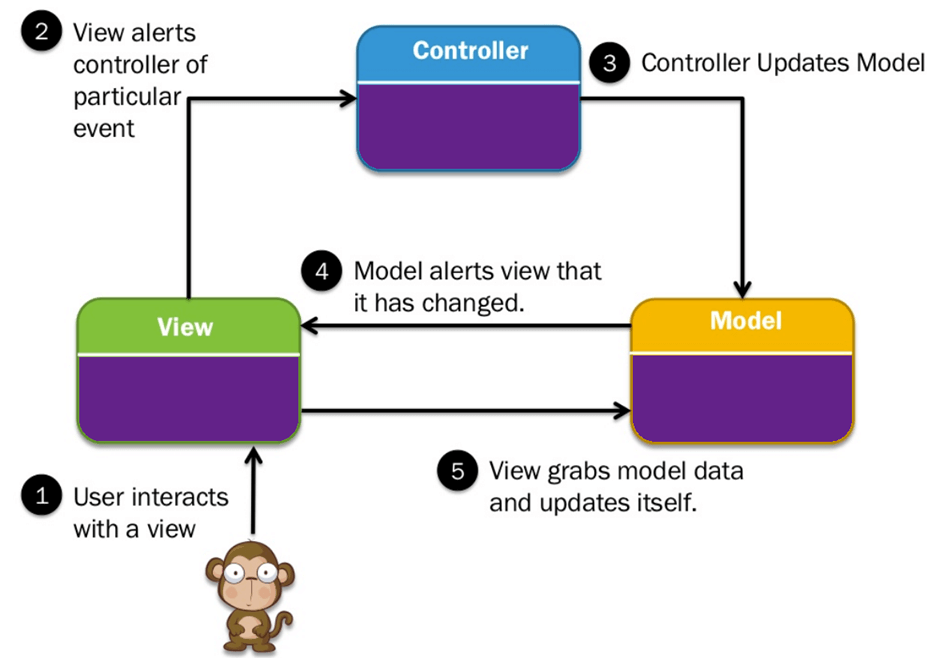

name: inverse
layout: true
class: center, middle, inverse
---
# Software Architecture
## Architecture Patterns

.footnote[<a href="mailto:christian.ribeaud@fhnw.ch">Christian Ribeaud</a>]
???
---
template: inverse
# Layers
---
layout: false
.left-column[
  ## Layers
  ### Definition
]
.right-column[
The **Layers** architectural pattern helps to structure applications that can be decomposed into groups of subtasks in which each group of subtasks is at a particular level of abstraction.


]
---
layout: false
.left-column[
  ## Layers
  ### Definition
  ### Examples
]
.right-column[
## OSI Model
**OSI** (_Open Systems Interconnection_) is a reference model for how applications communicate over a network:
- 7 Layers
- Not used as-is. We prefer the TCP/IP model (similar concepts, slightly different layers).


]
???
- https://www.youtube.com/watch?v=LANW3m7UgWs
- https://medium.com/@tomanagle/the-osi-model-explained-in-simple-terms-2abc3c7adadc
- https://www.guru99.com/difference-tcp-ip-vs-osi-model.html
---
layout: false
.left-column[
  ## Layers
  ### Definition
  ### Examples
]
.right-column[
  ## Java Application


]
---
layout: false
.left-column[
  ## Layers
  ### Definition
  ### Examples
  ### Multitier
]
.right-column[
Components within the layered architecture pattern are organized into horizontal layers, each layer performing a specific role within the application (e.g., _presentation logic_ or _business logic_).

Although the layered architecture pattern does not specify the number and types of layers that must exist in the pattern, most layered architectures consist of four standard layers: _presentation_, _business_, _persistence_, and _database_.


]
???
- https://en.wikipedia.org/wiki/Multitier_architecture
- https://www.oreilly.com/library/view/software-architecture-patterns/9781491971437/ch01.html: In some cases, the business layer and persistence layer are combined into a single business layer, particularly when the persistence logic (e.g., **SQL** or **HSQL**) is embedded within the business layer components. Thus, smaller applications may have only three layers, whereas larger and more complex business applications may contain five or more layers.
---
layout: false
.left-column[
  ## Layers
  ### Definition
  ### Examples
  ### Multitier
  ### Three-tier
]
.right-column[

]
---
template: inverse
# Pipes and Filters
---
layout: false
.left-column[
  ## Pipes and Filters
  ### Definition
]
.right-column[
Decompose a task that performs complex processing into a series of separate elements that can be reused.

This can improve performance (parallelization), scalability, testing, and reusability by allowing task elements that perform the processing to be deployed and scaled independently.


]
???
- https://medium.com/@syedhasan010/pipe-and-filter-architecture-bd7babdb908
- [AWS Step Functions](https://aws.amazon.com/step-functions/)
- Multithreading, queues, ...
---
layout: false
.left-column[
  ## Pipes and Filters
  ### Definition
  ### Examples
]
.right-column[
## Compiler


## Unix
Concatenation of simple programs (filters) via the textual input and output using the pipe symbol `|`. Example: list all **Java** source code files of a directory according to the number of lines of code.
```bash
wc *.java | sort -n | awk '/.+java/ {print $1 "\t" $4}'
```
]
???
- [Camel](https://camel.apache.org/)
---
layout: false
.left-column[
  ## Pipes and Filters
  ### Definition
  ### Examples
  ### Characteristics
]
.right-column[
- Each filter is a black box (users of the system don't need to know the logic behind the working of each filter) with a defined interface for data transmission and format.
- Filters can be combined and exchanged as required (loose coupling), assuming the interfaces and data formats fit together.
- Simple filters are easier to combine.
- Filters can data filter, enrich or convert.
- Filters can process the data in one go or in batches (streaming).
- Pull principle: filters actively fetch the data from the pipe.
- Push principle: pipe actively pushes the data into the filter.
- Pipes can work synchronously or asynchronously. In the latter case, they are often queues.
]
???
- https://medium.com/@syedhasan010/pipe-and-filter-architecture-bd7babdb908
- Disadvantages?
  - Addition of a large number of independent filters may reduce performance due to excessive computational overheads.
  - Not a good choice for an interactive system.
  - Pipe-and-filter systems may not be appropriate for long-running computations.
---
template: inverse
# Model-View-Controller
---
layout: false
.left-column[
  ## MVC
  ### Definition
]
.right-column[
**MVC** divides an interactive application into _three_ components.

The **Model** contains the core functionality and data. **Views** display information to the
user. Controllers handle user input. **Views** and **Controllers** together comprise the user interface.

A change-propagation mechanism ensures consistency between the user interface and the model.


]
???

---
layout: false
.left-column[
  ## MVC
  ### Definition
  ### Model
]
.right-column[
## Model
Data and business logic.
- **Model** is independent of **Controller** and **View**
- Defines interface for:
  - Read data
  - Manipulate data and
  - Initiate data processing (synchronous or asynchronous)
  - Data changed listener registration/deregistration
]
---
layout: false
.left-column[
  ## MVC
  ### Definition
  ### Model
  ### View
]
.right-column[
## View
Presentation of the data (or a part of it) as a graphic and/or as text.
- Data output
- Depending on the **Model**:
  - Registers itself as a data changed listener to the **Model**
  - Reads data from the **Model**
- Specific to a certain **Model**
]
---
layout: false
.left-column[
  ## MVC
  ### Definition
  ### Model
  ### View
  ### Controller
]
.right-column[
## Controller
Control of **Model** and **View** by user interactions.
  - Data input
  - Depending on the **Model**: data manipulation and processing
  - Influences state of the view
  - Often strong coupling between **View** and **Controller**
]
---
layout: false
.left-column[
  ## MVC
  ### Definition
  ### Model
  ### View
  ### Controller
  ### Class diagram
]
.right-column[


### Example

**Java Swing** Library, z.B. `JTree`:
- Model(s): `TreeModel`, `SelectionModel`
- View(s): `TreeCellRenderer`, `TreeCellEditor`
- Controller: `TreeUI`
]
???

- Traditionally used for desktop graphical user interfaces (GUIs), this pattern has become popular for designing web applications.
- Derivations:
  - [MVP](https://en.wikipedia.org/wiki/Model%E2%80%93view%E2%80%93presenter)
  - [MVVM](https://en.wikipedia.org/wiki/Model%E2%80%93view%E2%80%93viewmodel)
- https://blog.gisspan.com/2017/02/Redux-Vs-MVC,-Why-and-How.html
---
template: inverse
# Serverless
---
layout: false
.left-column[
  ## Serverless
  ### Definition
]
.right-column[
Serverless architectures are application designs that incorporate third-party _Backend as a Service_ (**BaaS**) services, and/or that include custom code run in managed, ephemeral containers on a _Functions as a Service_ (**FaaS**) platform.
]
???
- [AWS Lambda](https://aws.amazon.com/lambda/)
- https://martinfowler.com/articles/serverless.html
---
layout: false
.left-column[
  ## Serverless
  ### Definition
  ### Examples
]
.right-column[
## From

## To

]
???
 In the original version, all flow, control, and security was managed by the central server application. In the **Serverless** version there is no central arbiter of these concerns. Instead we see a preference for **choreography over orchestration**, with each component playing a more architecturally aware role—an idea also common in a microservices approach.
---
template: inverse
# Event-Driven
---
layout: false
.left-column[
  ## Event-Driven
  ### Definition
]
.right-column[

]
???
- https://codeburst.io/software-architecture-the-difference-between-architecture-and-design-7936abdd5830
- https://pradeeploganathan.com/architecture/event-driven-architecture/
- https://docs.microsoft.com/en-us/azure/architecture/guide/architecture-styles/event-driven
---
template: inverse
# Microservices
---
layout: false
.left-column[
  ## Microservices
  ### Definition
]
.right-column[
Microservices architecture has become the most popular architecture in the last few years.

It depends on developing small, independent modular services where each service solves a specific problem or performs a unique task and these modules communicate with each other through well-defined API to serve the business goal.


]
???
- [Architektur-Spicker3-Microservices.pdf](Architektur-Spicker3-Microservices.pdf)
- https://docs.microsoft.com/en-us/azure/architecture/guide/architecture-styles/microservices
- https://www.pluralsight.com/guides/solid-design-microservices
---
layout: false
.left-column[
  ## Microservices
  ### Definition
]
.right-column[
]